# MSET: Multimodal Semantic-Enhanced Real-World Beam Prediction via Temporal Modeling with Visual Foundation Models

This is the official repository for the paper **"Multimodal Semantic-Enhanced Real-World Beam Prediction via Temporal Modeling with Visual Foundation Models"**.

### Feixiang Liu, Xiaohui Li, Wenhui Gao, Jiaqing Xiong, Guanchong Niu and Chung Shue Chen

#### Xidian University，China
#### Nokia Bell Labs，France

---

### Framework Architecture

MSET is a lightweight, efficient multimodal beam prediction framework tailored for real-world scenarios. It combines visual semantics, temporal modeling, and positional priors to achieve robust performance in complex and dynamic V2I environments.

  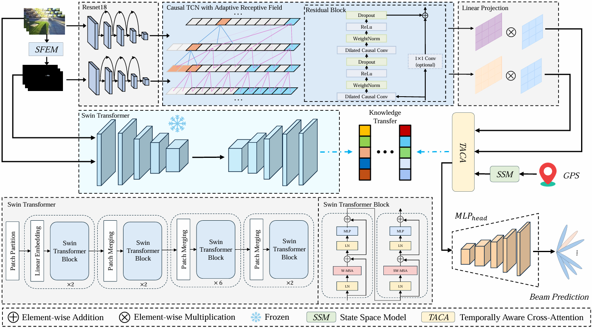 
  <em>Figure: Overview of the proposed MSET framework.</em>

  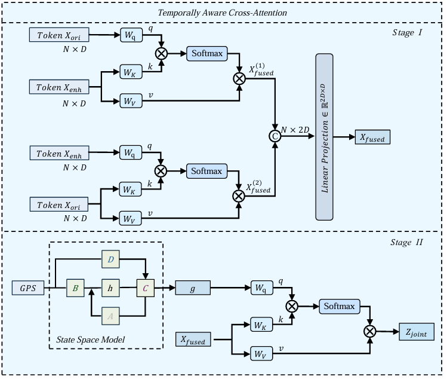 
  <em>Figure: The TACA fusion module.</em>

---

### Setup

Experiments are conducted on the DeepSense 6G dataset.

| Experimental Setup | Dataset Scenarios |
| :---: | :---: |
|  |  |
| *Figure: Data collection platform.* | *Figure: Sample V2I scenarios.* |

---

## Experimental Results

### Overall Performance Across Scenarios

Our method ("Ours") consistently outperforms all baselines in Top-k accuracy across eight different real-world scenarios.

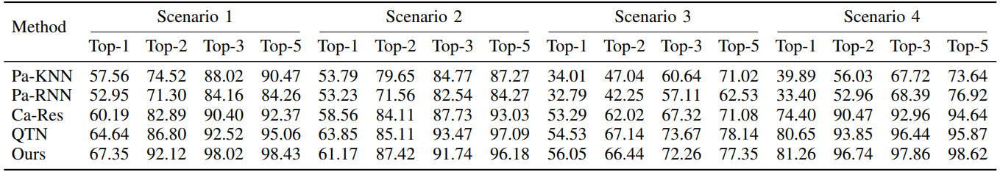
*Table: Performance on Scenarios 1-4.*

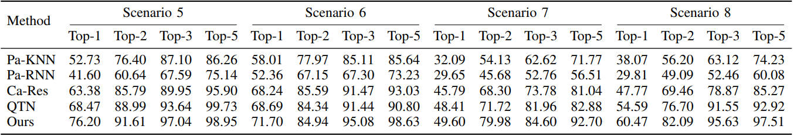
*Table: Performance on Scenarios 5-8.*

### Task-Specific Performance

The model shows state-of-the-art performance when scenarios are grouped into more challenging, specific tasks.

| Single-Target Task | Multi-Target Task |
| :---: | :---: |
|  |  |
| *Figure: Top-k accuracy (Scenarios 5-8).* | *Figure: Top-k accuracy (Scenarios 1-4).* |

| Nighttime Task | Daytime Task |
| :---: | :---: |
| 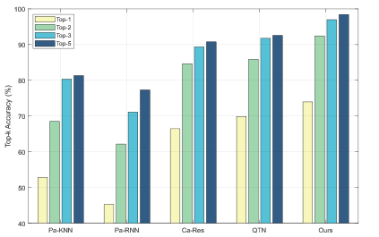 | 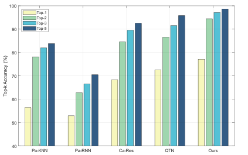 |
| *Figure: Top-k accuracy (Scenarios 2, 4, 5).* | *Figure: Top-k accuracy (Scenarios 1, 3, 6, 7, 8).* |

### Error Analysis

Confusion matrices show that prediction errors are overwhelmingly concentrated on beams adjacent to the ground truth, indicating high reliability.

*Figure: Row-normalized confusion matrices for beam prediction across the four tasks.*

### TCN Experiments
##### Temporal ablation

To isolate the effect of the depth gate, we keep the temporal stack (kernel size, dilations, and number of layers) fixed and only change the receptive-field mechanism. Compared with the fixed receptive-field baseline, a fixed-depth gate brings only modest improvements in Top-1/Top-5 and power loss. In contrast, the proposed volatility-driven gate achieves clearly higher Top-1/Top-5 accuracy and lower power loss **with identical temporal complexity**, showing that conditioning the gate on motion volatility is substantially more effective than a static pattern.

  
   
  <em>Temporal ablation on Task 2.</em>

##### Threshold sensitivity (Table Right)

We further study the sensitivity of the volatility-driven gate to the initialization of its thresholds. Across three representative initialization schemes — **Init-A** (narrow linear ramp), **Init-B** (wider linear ramp), and **Init-C** (Init-A with small Gaussian noise) — the final Top-1/Top-5 accuracy and power loss remain very close, and the learned thresholds stay ordered and monotone in depth. This indicates that the volatility-driven TCN is **robust to reasonable threshold initializations** and consistently outperforms the fixed receptive-field baseline.

  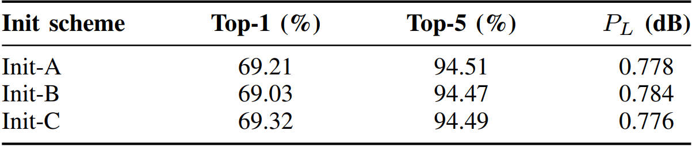
   
  <em>Right: Sensitivity of threshold initialization on Task 2.</em>

  
  

  <em>Left: Temporal ablation on Task 2. &nbsp; Right: Sensitivity of threshold initialization on Task 2.</em>

### Why our combination is optimal？
**VFM ablation.**  
We compare **Swin-B**, **DeiT-B**, **ViT-B/16**, and **RegNetY-8G** as teachers under the same student and distillation settings. On Task 3 (night), **Swin-B** achieves the highest Top-1/Top-5 accuracy and the lowest power loss.

  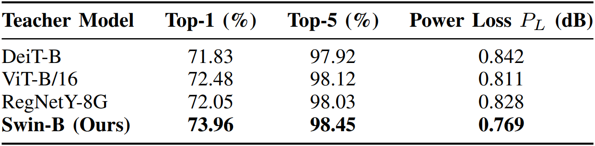
   
  <em>VFM ablation</em>

**Student ablation.**  
For the student, we compare **ResNet-18 (ours)** with **MobileViT-S** and **EfficientNet-B0**. With Swin-B fixed as teacher, ResNet-18 attains the best Top-1/Top-5 accuracy, the lowest power loss, and about **2× lower latency** (2.86 ms) than the lightweight transformer and EfficientNet baselines, making it a strong deployment backbone under millisecond-level constraints.

  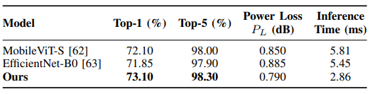
   
  <em>Student ablation</em>

**Temporal module ablation.**  
On the GPS stream, we compare a **Mamba-style selective state-space module (ours)** with **GRU** and **LSTM**. Under the same visual backbone and distillation, the SSM yields higher Top-1/Top-5 accuracy and lower power loss, while keeping latency comparable or lower. It also handles irregular GPS sampling more stably than recurrent baselines, which is crucial for our asynchronous deployment regime.

  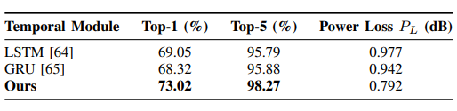
   
  <em>Temporal module ablation</em>

### Knowledge distillation experiment

Beam prediction depends on spatially localized cues rather than only final class logits, so we use a mask-weighted, tokenwise KL loss instead of a purely class-level objective. The Swin-Transformer teacher provides rich multi-scale token features, and token-level distillation lets the student mimic this spatial structure, with SAM-derived weights focusing supervision on propagation-relevant regions and down-weighting background tokens. We compare our loss against two classical baselines under the same teacher, student, temperature, and training setup on Task 1:

  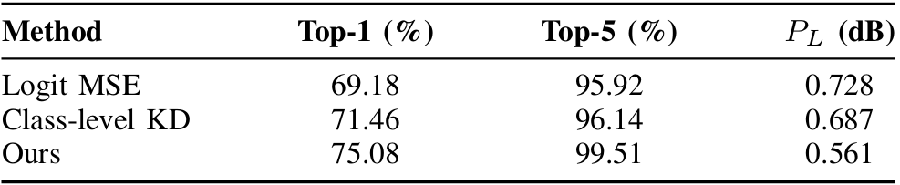
   
  <em>KD</em>

### Protocol

We embed MSET into the 5G-Advanced beam management procedure. At each decision step, MSET predicts class probabilities and outputs a ranked Top-K list of candidate beams. The base station then probes only these K beams instead of sweeping the entire beam codebook, so the MAC signaling remains standard and MSET acts as a learned prior that narrows the search space. With K typically between 3 and 5, the probing load is reduced by roughly three to five times compared with exhaustive sweeping, while maintaining link quality.

   
  <em>*Figure: MSET-Assisted Beam Search and Tracking Protocol.*</em>

---

## Code

Our code is coming soon...

