# Multimodal Semantic-Enhanced Real-World Beam Prediction via Temporal Modeling with Visual Foundation Models

This is the official repository for the paper **"Multimodal Semantic-Enhanced Real-World Beam Prediction via Temporal Modeling with Visual Foundation Models"**.

### Feixiang Liu, Xiaohui Li, Wenhui Gao, Jiaqing Xiong, Guanchong Niu and Chung Shue Chen

#### Xidian University，China
#### Nokia Bell Labs，France

### Framework Architecture

Our model introduces a novel fusion module, knowledge transfer, and a foundation model to significantly improve performance over existing approaches. The architecture is built on a teacher-student design with dedicated modules for temporal modeling and multimodal fusion.

  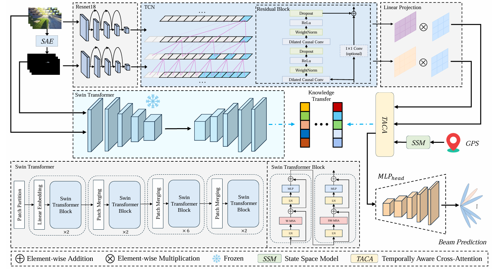 
  <em>Figure: Overview of the proposed framework.</em>

  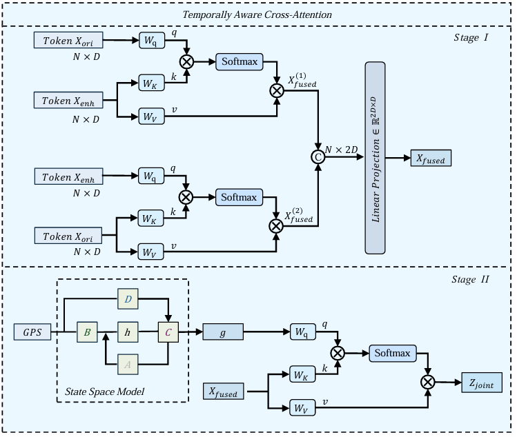 
  <em>Figure: The TACA fusion module.</em>

### Setup

Our approach fuses multimodal data using a Temporally Aware Cross-Attention (TACA) module, conditioned by a Mamba (SSM) based GPS prior. Experiments are conducted on the DeepSense 6G dataset.

| Experimental Setup | Dataset Scenarios |
| :---: | :---: |
| 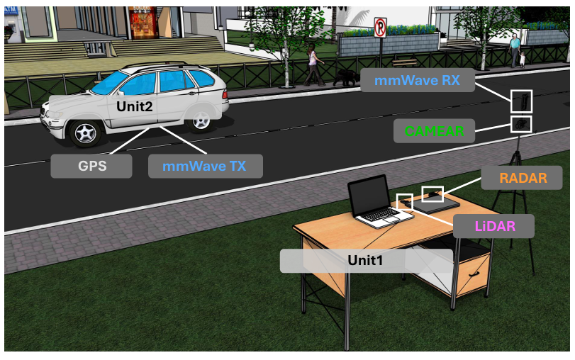 | 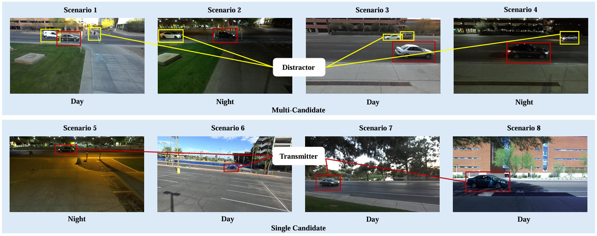 |
| *Figure: Data collection platform.* | *Figure: Sample V2I scenarios.* |

---

## Experimental Results

### Overall Performance Across Scenarios

Our method ("Ours") consistently outperforms all baselines in Top-k accuracy across eight different real-world scenarios.

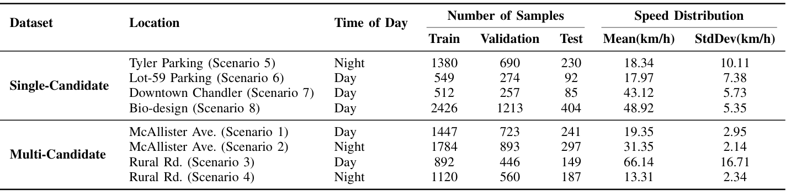
*Table II: Performance on Scenarios 1-4.*

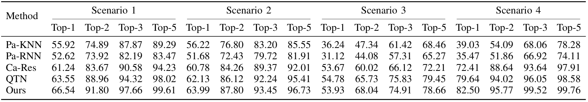
*Table III: Performance on Scenarios 5-8.*

### Task-Specific Performance

The model shows state-of-the-art performance when scenarios are grouped into more challenging, specific tasks.

| Single-Target Task | Multi-Target Task |
| :---: | :---: |
| 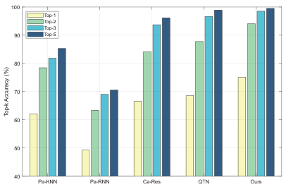 | 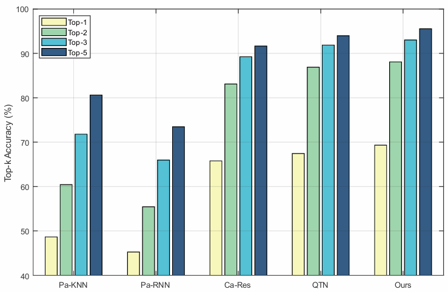 |
| *Figure 7: Top-k accuracy (Scenarios 5-8).* | *Figure 8: Top-k accuracy (Scenarios 1-4).* |

| Nighttime Task | Daytime Task |
| :---: | :---: |
| 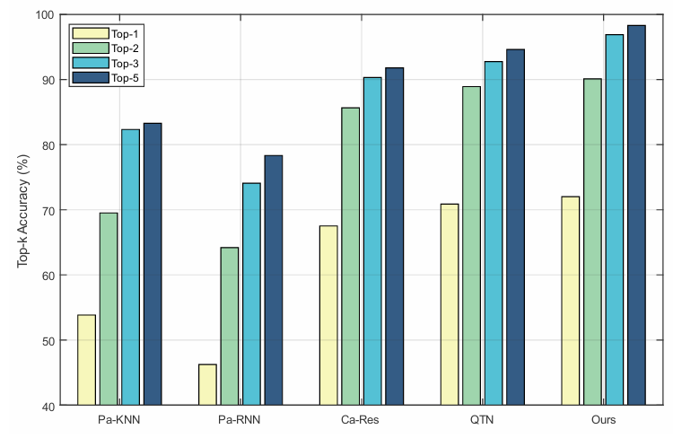 | 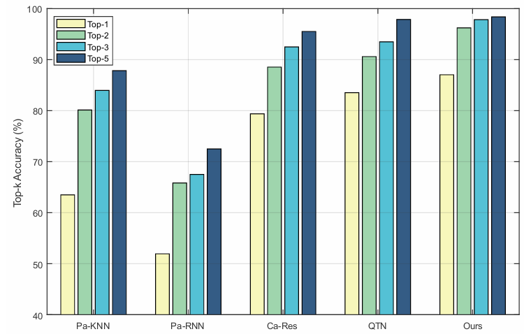 |
| *Figure 10: Top-k accuracy (Scenarios 2, 4, 5).* | *Figure 11: Top-k accuracy (Scenarios 1, 3, 6, 7, 8).* |

### Error Analysis

Confusion matrices show that prediction errors are overwhelmingly concentrated on beams adjacent to the ground truth, indicating high reliability.

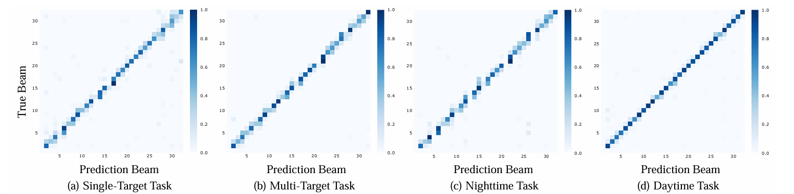
*Figure 12: Row-normalized confusion matrices for beam prediction across the four tasks.*

---

## Code

Code coming soon.

